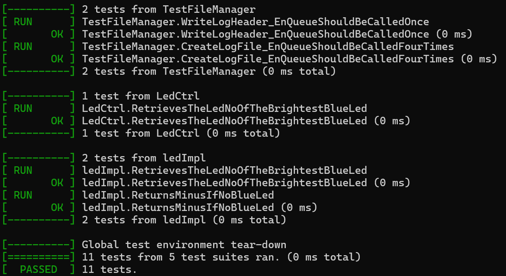

# embeded-testing-guide

Introduction Guide to Embedded Software Unit Testing using google test

This guide is a slightly modified version of the material I used to introduce unit testing to my embedded development team.

Please visit guide page.

[https://kimatata.github.io/embeded-testing-guide/](https://kimatata.github.io/embeded-testing-guide/)


## Sample Code

The code under the code directory is the sample Google test code used in the guide. You can run test suites, and generate coverage report.



<hr />

## For Developer

### how to edit guide

This guide is generated by docusarurus. For detailed settings, please refer to the [official website.](https://docusaurus.io/)

### Local Development

```bash
npm run start
```

if you want to start localized site in dev mode, please specify like below.

```bash
npm run start -- --locale ja
```

### Deploy to Github pages

```bash
npm run deploy
```
