# Unit Testing Methods

In general, test code checks expected values using the following three patterns:

- Output-based testing
- State-based testing
- Communication-based testing

## Output-based Testing

This method verifies whether the value returned by the code under test matches the expected value. It is the simplest and easiest to write but assumes that the code under test has no side effects.

```c title="Output-based Testing"
TEST(calcElapsedFreeCount, CanCalculateElapsedTimeCorrectlyEvenWithOverflow) {
    uint32_t startCount = 0xffffffff;
    uint32_t currentCount = 0x9;
    EXPECT_EQ(10, TrpSensing_calcElapsedFreeCount(startCount, currentCount));
}
```

## State-based Testing

This method checks the state (member variables) after the code under test is executed. It is slightly more complex compared to output-based testing. In C language, it looks like this:

```c title="プロダクトコード couter.h"
#ifndef COUNTER_H
#define COUNTER_H

typedef struct {
    int value;
} Counter;

void initCounter(Counter* counter);
void incrementCounter(Counter* counter);
int getCounterValue(Counter* counter);

#endif // COUNTER_H
```

```c title="production code couter.c"
#include "counter.h"

void initCounter(Counter* counter) {
    counter->value = 0;
}

void incrementCounter(Counter* counter) {
    counter->value++;
}

int getCounterValue(Counter* counter) {
    return counter->value;
}
```

```c title="test code testCounter.c"
TEST(CounterTest, CounterInitialValueIsZero) {
    Counter counter;
    initCounter(&counter);
    EXPECT_EQ(getCounterValue(&counter), 0);
}

TEST(CounterTest, CounterValueIncrements) {
    Counter counter;
    initCounter(&counter);
    incrementCounter(&counter);
    EXPECT_EQ(getCounterValue(&counter), 1);
}
```

In object-oriented programming, this would be like checking the value of a class's member variables later.

## Communication-based Testing

This method verifies that the code under test correctly calls other functions or APIs. Verify the component being called by replacing it with a mock or spy. The implementation becomes more complex and the test code longer.

