# Dependencies

When applying unit tests to code for embedded products, the build may fail in the test environment because the target code depends on code that only runs on a microcontroller. These hardware or microcontroller-specific dependencies are referred to as "collaborators." To make testing possible, you need to decouple these collaborators or replace them with test doubles.

## What are Test Doubles?

A test double is a general term that encompasses various substitute objects used in testing, such as dummies, stubs, mocks and spies.

- Dummy: An object that is used for passing through links in the test but is otherwise unused.
- Stub: A substitute object that returns predefined values.
- Mock: An object that can record and verify the number of function calls and parameters during testing, simulating specific behaviors. These are often provided by testing frameworks.
- Spy: A type of custom mock that specifically tracks how a function was called, such as the number of calls and the arguments used.

:::info[Test Doubles Outside Embedded Development]

The use of test doubles is not limited to embedded systems. In fields like web development, where testing might seem easier than in embedded systems, there are still many cases where test doubles are needed.

For example, when testing code that retrieves data from a database and displays it, using an expensive database like Oracle used in production environment may not be practical. In such cases, you might replace the database with a stub for testing. Similarly, when calling external web APIs, repeatedly making API calls can increase test execution time. Depending on network conditions, the tests may pass or fail inconsistently. In these cases, test doubles can improve the efficiency and stability of tests.

:::

## Dependency Separation

There are several patterns for breaking dependencies:

- Extracting logic
- Compile-time switches
- Replacing with the linker
- Using mocks
- Replacing with function pointers

Each method will be explained in detail in the next and subsequent chapters.