# Communication-Based Testing

What should you do when the code under test does not return a calculated result or store the outcome of a process, but instead only calls other functions or APIs?

In communication-based testing, external components are replaced with "mocks" or "spies". By using these substitutes, the test code can manipulate them to verify how the intermediate code behaves. More details on testing with spies and mocks will be presented in the next chapter and beyond.

Mocks are powerful tools, and using them makes it possible to test any code, even in embedded software. However, excessive use of mocks can lead to increased test code volume and make the tests harder to maintain.
