# Output-based Testing

This method verifies whether the value returned by the code under test matches the expected value. It is the simplest and easiest to write but assumes that the code under test has no side effects.



```c title="Output-based Testing"
TEST(Counter, CanCalculateElapsedTimeCorrectlyEvenWithOverflow) {
    uint32_t startValue = 0xffffffff;
    uint32_t currentValue = 0x9;
    EXPECT_EQ(10, Counter_GetElapsedCount(startValue, currentValue));
}
```
