# State-based Testing

This method verifies the state after the code under test is executed. State-based testing is useful when the code manages internal state. It is especially appropriate when state transitions occur, such as in the management of counters, buffers, and flags in embedded software.



```c title="production code couter.h"
#ifndef COUNTER_H
#define COUNTER_H

typedef struct {
    uint32_t value;
    uint32_t overflowCount;
} Counter;

void Counter_Init(Counter *counter);
void Counter_Update(Counter *counter);
uint32_t Counter_GetValue(Counter *counter);
uint32_t Counter_GetOverflowCount(Counter *counter);

#endif // COUNTER_H
```

```c title="production code couter.c"
#include "counter.h"

void Counter_Init(Counter *counter) {
    counter->value = 0;
    counter->overflowCount = 0;
}

void Counter_Update(Counter *counter) {
    counter->value++;

    // when overflows
    if (counter->value == 0) {
        counter->overflowCount++;
    }
}

uint32_t Counter_GetValue(Counter *counter) {
    return counter->value;
}

uint32_t Counter_GetOverflowCount(Counter *counter) {
    return counter->overflowCount;
}
```

```c title="test code testCounter.c"
TEST(Counter, CounterOverflows) {
    Counter counter;
    Counter_Init(&counter);

    counter.value = UINT32_MAX - 1;
    Counter_Update(&counter);
    EXPECT_EQ(Counter_GetValue(&counter), UINT32_MAX);
    EXPECT_EQ(Counter_GetOverflowCount(&counter), 0);

    // trigger overflow
    Counter_Update(&counter);
    EXPECT_EQ(Counter_GetValue(&counter), 0);
    EXPECT_EQ(Counter_GetOverflowCount(&counter), 1); // overflow count will be 1
}
```
