# 依存関係

組み込み製品のコードに単体テストを適用しようとすると、テスト対象コードがマイコン上でしか動作しないコードに依存しているため、テスト環境ではビルドが通らないと思われます。このようなハードウェアやマイコン固有の依存関係を「コラボレータ」と呼びます。テストを可能にするためには、これらのコラボレータを切り離したり、テストダブルで置き換える必要があります。

## ダブルとは

テストダブルとは、ダミー、スタブ、モック、スパイなど、テストで使用する代替オブジェクトの総称です。

- ダミー: テストのために必要最低限のオブジェクト。特にリンクを通すためだけのもの。
- スタブ: 固定値を返す代替オブジェクト。
- モック:  テスト中に関数の呼び出し回数やパラメータを記録・検証することができ、特定の振る舞いをシミュレーションします。多くの場合、テスティングフレームワークが提供します。
- スパイ: 自作のモックの一種で、特に関数がどのように呼ばれたか（呼び出し回数や引数など）を追跡します。

:::info[組み込み以外でのテストダブルの使用]

テストダブルを使用するのは組み込み特有の話ではありません。Web開発など、組み込みよりもテストが容易に思われる領域でも、テストダブルを使用する必要があるケースが多くあります。

例えば、データをデータベースから取得して表示するようなテストがある場合、本番環境で使用しているOracleなどの高価なデータベースを使うのは現実的ではありません。そのため、テスト用にスタブで置き換えることがあります。また、外部のWeb APIを呼び出すテストでは、実際にAPIを何度も呼び出すと時間がかかり、テスト実行が遅延します。また、通信環境によってテストが不安定になることもあります。このような場合、ダブルを使ってテストの効率と安定性を向上させることができます。

:::

## 依存関係の分離

依存関係を断ち切るための方法は以下のパターンがあります。次章以降で各手法について詳しく解説します。

- ロジックの抽出
- コンパイルスイッチ
- リンカで置き換え
- モック
- 関数ポインタで置き換え
