# コミュニケーションベーステスト

テスト対象のコードが特に計算結果を返したり、処理結果を保存するのではなく、ほかの関数やAPIを呼び出しているだけの場合、どうやってそれをテストすればいいのでしょうか?

コミュニケーションベーステストでは、外部コンポーネントをモックやスパイといったものに置き換え、それをテストコードが操ることで中間にあるテスト対象コードのふるまいを検証します。スパイやモックを利用したテストの詳細は次章以降で詳しく紹介します。

モックは強力で、これを使えば組み込みソフトウェアであってもテストできないコードはありません。しかし、モックを多用したテストはテストコードの量が増え、保守しにくいといった特徴があります。
