# 出力値ベーステスト

テスト対象のコードが返す値が期待値と同じかどうか検証します。シンプルにテストを簡単に書くことができますが、テスト対象の関数が参照透過性（引数が同じ場合、常に同じ返り値となる）を満たす必要があります。



```c title="出力値ベーステスト"
TEST(Counter, オーバーフローしても正しく経過カウントを計算できる) {
    uint32_t startValue = 0xffffffff;
    uint32_t currentValue = 0x9;
    EXPECT_EQ(10, Counter_GetElapsedCount(startValue, currentValue));
}
```
