# 状態ベーステスト

テスト対象コードが実行された後の状態を検証するテストです。状態ベーステストは、テスト対象のコードが内部状態を管理している場合に有効です。特に、組み込みソフトウェアでのカウンタやバッファ、フラグの管理のように、状態遷移が発生する場合に適しています。



```c title="プロダクトコード couter.h"
#ifndef COUNTER_H
#define COUNTER_H

typedef struct {
    uint32_t value;
    uint32_t overflowCount;
} Counter;

void Counter_Init(Counter *counter);
void Counter_Update(Counter *counter);
uint32_t Counter_GetValue(Counter *counter);
uint32_t Counter_GetOverflowCount(Counter *counter);

#endif // COUNTER_H
```

```c title="プロダクトコード couter.c"
#include "counter.h"

void Counter_Init(Counter *counter) {
    counter->value = 0;
    counter->overflowCount = 0;
}

void Counter_Update(Counter *counter) {
    counter->value++;

    // オーバーフローしたとき
    if (counter->value == 0) {
        counter->overflowCount++;
    }
}

uint32_t Counter_GetValue(Counter *counter) {
    return counter->value;
}

uint32_t Counter_GetOverflowCount(Counter *counter) {
    return counter->overflowCount;
}
```

```c title="テストコード testCounter.c"
TEST(Counter, オーバーフローカウントが増えること) {
    Counter counter;
    Counter_Init(&counter);

    counter.value = UINT32_MAX - 1;
    Counter_Update(&counter);
    EXPECT_EQ(Counter_GetValue(&counter), UINT32_MAX);
    EXPECT_EQ(Counter_GetOverflowCount(&counter), 0);

    // オーバーフローさせる
    Counter_Update(&counter);
    EXPECT_EQ(Counter_GetValue(&counter), 0);
    EXPECT_EQ(Counter_GetOverflowCount(&counter), 1); // オーバーフローカウントが1になる
}
```